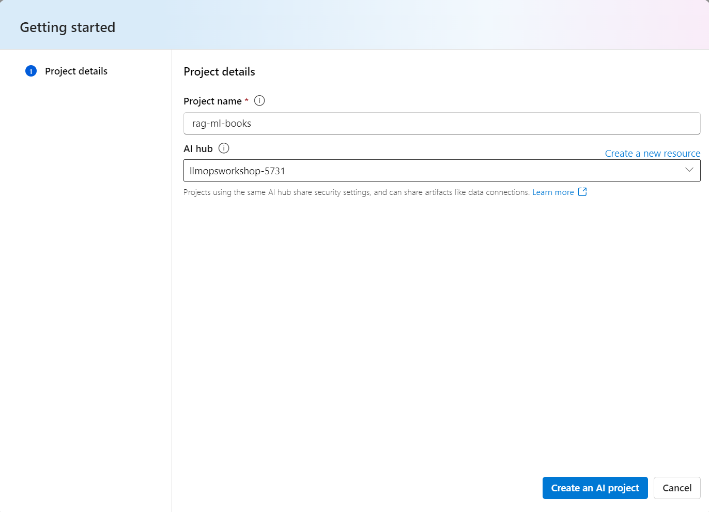
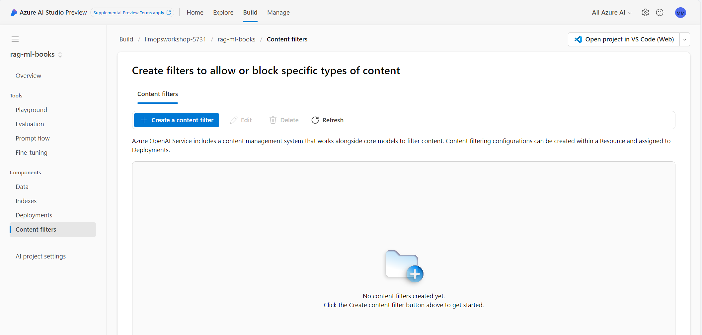

#### Introduction to LLMs and Azure AI Services

In this lab, we will have an overview on how to use Azure AI to work with large language models.

The focus will be more on an overview of the creation process, so that in the next lessons we will delve deeper into the build, evaluation, deployment, and monitoring process.

1) Create a new Azure AI Resource
2) Create a project in Azure AI Studio.
3) Deploy an Azure OpenAI model.
4) Use AzureAI Studio Playground.
5) Customize Content Filtering to deployed model.

Azure AI Studio brings together capabilities from across multiple Azure AI services.


Azure AI Studio is designed for developers to:

- Build generative AI applications on an enterprise-grade platform.
- Seamlessly explore, build, test, and deploy using cutting-edge AI tools and ML models, grounded in responsible AI practices.
- Build together as one team. Your Azure AI hub resource provides enterprise-grade security, and a collaborative environment with shared files and connections to pretrained models, data and compute.


#### 1) Create a new Azure AI hub Resource

The Azure AI hub resource is the top-level Azure resource for AI Studio and provides **the working environment for a team** to build and manage AI applications. In Azure, resources enable access to Azure services for individuals and teams. Resources also provide a container for billing, security configuration and monitoring.

Go to your browser and type: https://ai.azure.com

After logging in with your Azure account, you will see the following screen:


Let's now create an AI hub resource in AzureAI studio.

In the Manage tab, select New AI hub, and enter a new name for your AI hub resource. Make sure to create a new Azure AI search, we will use it later to index our documents.


#### 2) Create a project in Azure AI Studio

Let's now create a project in AzureAI resource.

In the Build tab, select New project.

To create a project, choose a unique name, and select the AI hub resource we just created.




#### 2) Deploy an Azure OpenAI model

After creating your AI Project, the first step is to create a deployment of an OpenAI model so you can start experimenting with the prompts you will use in your application.

To do this, access your newly created project in the **Build** tab of the AI Studio, select the **Deployments** option, and click on **Create (Real-time endpoint)**.


From the list of models, select **gpt-4**.


On the next screen, define the name of the deployment, in this case, you can use the same name as the model and in the version field select the latest available version, in the example below we chose version 1106-preview (gpt4-turbo).


Done! Your model deployment is created and now you can test it in the Playground.

#### 3) Use AzureAI Studio Playground

On the screen with the deployment information, select the **Open in playground** button.


In this lab, we will run an example where the model will help us summarize and extract information from a conversation between a customer and a representative of a telco company.

Copy the following prompt into the system message field of the playground:

```
You're an AI assistant that helps insurance company to extract valuable information from their conversations by creating JSON files for each conversation transcription you receive. 
You should extract the following information from the telephone conversation below:

1. Reason for call (key: reason)
2. Cause of the incident (key: cause)
3. Names of all drivers in table form (key: name_drivers)
4. Insurance number (key: insured number)
5. Location of the accident (key: location)
6. Damage to the car in table form (key: damage)
7. Customer sentiment (key: customer_sentiment) 
8. Customer state after the incident (key: customer_state)
9. Persons injured, names in table form if any, or 'No' if no one injured (key: people_injured)
10. Topics, very short, posed by the agent to the client, in the form of a table (key: questions_agent)
11. A short, but detailed summary (key: summary) 

Make sure that the answers to fields 1 to 6 are very short, for example, for the place, simply indicate the name of the place.

Please respond in machine-readable JSON format, using the keys above. Format the output as a JSON object called "results". Nicely print the JSON and make sure it's properly closed at the end.
```

After copying, select "Apply changes"


Then type the following text in the chat session and click the send button:

```
Hello, I just had a car accident and wanted to report it. OK, I hope you're well and that you're in a safe place to have this conversation. Yes I am fine thank you. Can you describe to me what happened? I was driving on the M23 and hit another car. Are you doing well ? Yes, I'm just a little shaken. It's understandable. Can you give me your full name? Of course, it's Sarah Standl. Do you know what caused the accident? I think I may have hit a pothole. Ok, where did the accident take place? On the M23, near Junction 10. Anyone else hurt? I do not think so. But I'm not sure. OK, we're going to have to investigate. Can you give me the contact details of the other driver? Of course, his name is John Radley. And your insurance policy number. Okay. Give me a minute. OK, it's 546452. OK, is there any damage to your car? Yes, the headlights are broken, and the airbags are triggered. Will you be able to drive it? I do not think so. I'll have it towed. Well, it will have to be inspected. I will assist you and order a tow truck for you. I will also start the claim and we will settle everything. THANKS.
```

You will see a result generated by the model similar to the one shown in the image below.

Notice that the model correctly followed the instructions indicated in the System message field:


#### 4) Add Custom Content Filtering to Model Deployment

Azure AI Studio includes a content filtering system that works alongside core models.

This system is powered by Azure AI Content Safety, and now works by running both the prompt and completion through an ensemble of classification models aimed at detecting and preventing the output of harmful content. The content filtering system detects and takes action on specific categories of potentially harmful content in both input prompts and output completions.

You can create a content filter or use the default content filter for Azure OpenAI model deployment, and can also use a default content filter for other text models curated by Azure AI in the model catalog.

To create a content filter, you could go to Build, choose one of your projects, then select Content filters in the left navigation bar, and create a content filter.



The content filtering system integrated in Azure AI Studio contains neural multi-class classification models aimed at detecting and filtering harmful content; the models cover four categories (hate, sexual, violence, and self-harm) across four severity levels (safe, low, medium, and high). Content detected at the 'safe' severity level is labeled in annotations but isn't subject to filtering and isn't configurable.

Configure your custom content filtering to filter at the low severity threshold for all four content harms categories for user prompts.


A default content filter is set when you create a deployment. You can also apply your custom content filter to your deployment. Select Deployments and choose one of your deployments, then select Edit, a window of updating deployment will open up. Then you can update the deployment by selecting one of your created content filters.

