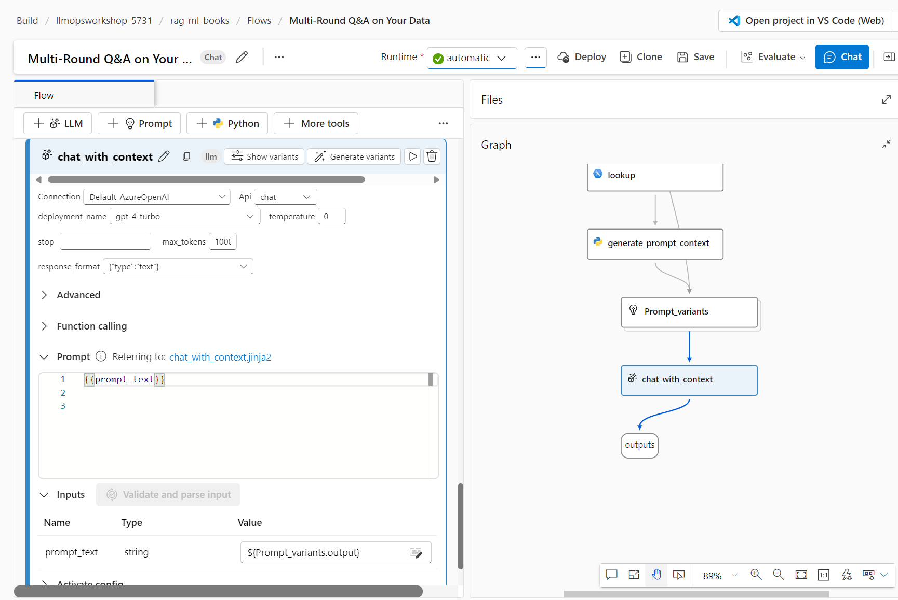

#### Building LLMs Orchestration Flows

Learn how to build prompt flow orchestrations for your LLM App.

During this lab, we will cover the following steps:

1) Create a Vector Index
2) Add your Vector Index in playground and test.
3) Create a conversational RAG flow.

#### Setup: Create a project in Azure AI Studio

If you are running this Lab after lesson 1, you don't need to worry about this step.

Otherwise, simply execute step 1 of lesson 1, which is to create a project in Azure AI Studio.

#### 1) Create a Vector Index

Large language models (LLMs) like ChatGPT are trained on public internet data which was available at the point in time when they were trained. They can answer questions related to the data they were trained on. This public data might not be sufficient to meet all your needs. You might want questions answered based on your private data. Or, the public data might simply have gotten out of date. The solution to this problem is Retrieval Augmented Generation (RAG), a pattern used in AI which uses an LLM to generate answers with your own data.

**How does RAG work?**

RAG is a pattern which uses your data with an LLM to generate answers specific to your data. When a user asks a question, the data store is searched based on user input. The user question is then combined with the matching results and sent to the LLM using a prompt (explicit instructions to an AI or machine learning model) to generate the desired answer. This can be illustrated as follows.

**What is an Index and why do I need it?**

RAG uses your data to generate answers to the user question. For RAG to work well, we need to find a way to search and send your data in an easy and cost efficient manner to the LLMs. This is achieved by using an Index. An Index is a data store which allows you to search data efficiently. This is very useful in RAG. An Index can be optimized for LLMs by creating Vectors (text/data converted to number sequences using an embedding model). A good Index usually has efficient search capabilities like keyword searches, semantic searches, vector searches or a combination of these.

Azure AI provides an Index asset to use with RAG pattern. The Index asset contains important information like where is your index stored, how to access your index, what are the modes in which your index can be searched, does your index have vectors, what is the embedding model used for vectors etc. The Azure AI Index uses Azure AI Search as the primary / recommended Index store. Azure AI Search is an Azure resource that supports information retrieval over your vector and textual data stored in search indexes.

Azure AI Index also supports FAISS (Facebook AI Similarity Search) which is an open source library that provides a local file-based store. FAISS supports vector only search capabilities and is supported via SDK only.

**Create a Vector Store in Azure AI Studio**

Open your web browser and navigate to: https://ai.azure.com

Enter the **Build** menu and then select the **Indexes** option and click on the blue "New Index" button.

Choose your Source data. Choose to upload files from the local machine, and upload the machine learning books provided under *lesson_02/files*.

We already have a connection created for an Azure AI Search service when we create the AI hub and created alongside an Azure AI Search resource, you can choose that from the dropdown. Make sure to add vector search to this index.

You can now see that the vector index is on the process of being created.

You can click on **Job Details** to take a look on the pipeline of the job in details.

#### 2) Add your Vector Index in playground and test.

Now let's test adding the vector index in the playground and see how we can answer questions about Machine Learning from the created index with our ML books.

In the **Build** menu, select the **Playground** option. Make sure to reset the to default system message.

Inside the playground, click on **Add your own data**, then in **data source**, select Azure AI search as your source of data to add the created vector index.

In the search type, select **hybrid**, and for the existing semantic configuration, select **azureml-default**. Review and Finish.

Now that your index is added, let's try and ask a question where you can find the answer in the books. 

#### 3) Create a conversational RAG flow

To create a conversational flow using the RAG pattern, start by creating a new flow in the Prompt Flow section within the **Build** area.

Select the **Multi-Round Q&A** on Your Data template.

A flow with the following structure will be created.

Once you cloned the flow, start an **automatic runtime**.

In Azure AI Studio, you can create and manage prompt flow runtimes. You need a runtime to use prompt flow.

A prompt flow runtime has computing resources that are required for the application to run, including a Docker image that contains all necessary dependency packages. In addition to flow execution, Azure AI Studio uses the runtime to ensure the accuracy and functionality of the tools incorporated within the flow when you make updates to the prompt or code content.

If you're a new user, we recommend that you use an automatic runtime. You can easily customize the environment for this runtime.

##### 3.1) Flow overview

The first node, `modify_query_with_history`, produces a search query using the user's question and their previous interactions. Next, in the `lookup` node, the user's question is transformed into an embedding using the text-embedding-ada-002 model. This embedding is then used to conduct a search within a vector store, which is where the RAG pattern retrieval takes place. Following the search process, the `generate_prompt_context` node consolidates the results into a string. This string then serves as input for the `Prompt_variants` node, which formulates various prompts. Finally, these prompts are used to generate the user's answer in the `chat_with_context` node.

##### 3.2) Search index

In the flow created in Prompt Flow to configure the `lookup` node, where you will fill in the information about the vector index we created. For index type, choose **Registed indexes**, and then choose the name of the vector index we created in the previous step.

##### 2.3) Updating connection information

Now you will need to update the Connections of the nodes that link with LLM models.  
   
Starting with the `modify_query_with_history` node, in the `Inputs` section select the `Default_AzureOpenAI` in the connection field and the gpt-4 deployement in the deployment_name.  
   
Then update the Connection the Connection for the `chat_with_context node` similarly with the gpt-4 deployment, as indicated below:

##### 2.4) Testing your RAG flow

Everything is now set up for you to initiate your chat flow. Simply click on the blue **Chat** button located at the top right corner of your page to begin interacting with the flow.

